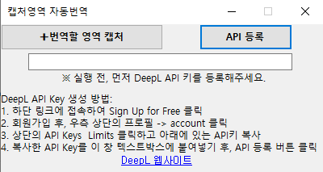
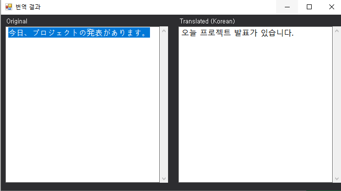

# 📸🔤CaptureTranslatorApp (C#)

## 🧭 프로젝트 소개

**CaptureTranslatorApp**은 **DeepL 번역 API**와 **OCR(광학 문자 인식)** 을 결합한 Windows Forms 애플리케이션입니다. 사용자가 화면에서 원하는 영역을 드래그로 캡처하면, 해당 이미지에서 텍스트가 자동으로 추출되고, DeepL API를 통해 번역되어 원문과 번역문이 함께 표시됩니다.

- DeepL API 사용 (개인 API 키 입력)
- Tesseract OCR을 통한 텍스트 추출
- 직관적인 결과 화면

---

## 💡 제작 동기

최근 유튜브에서 미국 대학생들이 Answer.ai라는 브라우저 확장 프로그램을 이용해 시험을 자동으로 푸는 장면을 보고, 이미지 기반 텍스트 분석 기술에 흥미를 가지게 되었습니다. 이를 계기로, 파파고의 이미지 번역 기능과 Windows 캡처 도구의 편리함을 결합한 도구가 있다면 더욱 직관적인 번역 경험을 제공할 수 있을 것이라 생각해 이 프로젝트를 기획하게 되었습니다.

---

## 📦 프로젝트 구조

```
CaptureTranslatorApp/
├── CaptureTranslatorApp/
│   ├── Properties/                   # 프로젝트 속성 (AssemblyInfo 등)
│   ├── FormMain.cs                   # 메인 폼 (API 키 입력 및 캡처 시작)
│   ├── CaptureOverlay.cs             # 화면 캡처 및 강조 영역 처리
│   ├── OCRManager.cs                 # OCR 전처리 및 텍스트 추출
│   ├── Translator.cs                 # DeepL API 연동 및 번역 처리
│   ├── FormResult.cs                 # 결과 출력 폼 (텍스트/번역 표시)
│   ├── Program.cs                    # 앱 진입점 (Main 함수)
│   ├── *.Designer.cs / *.resx       # 리소스 및 UI 설정 파일
│   ├── App.config, app.manifest
│   ├── CaptureTranslatorApp.csproj  # 프로젝트 파일
│   └── packages.config              # NuGet 패키지 정보
├── Screenshots/                      # (README에서 사용될 이미지)
├── CaptureTranslatorApp.sln         # 솔루션 파일
└── README.md

```

---

## 🗓️ 제작 기간

- **2025.05.05 ~ 2025.05.09 (총 5일)**

---

## 🧑 제작 인원

- 개인 프로젝트 (1인 개발)

---

## 💻 기술 스택

- **언어/프레임워크**: C# (.NET Framework, Windows Forms)
- **OCR**: Tesseract + OpenCvSharp4
- **번역 API**: DeepL Translator (Free API Key 사용)
- **기타**: System.Net.Http, JSON 파싱

---

## 🕹️ 설치 및 사용 방법

> Visual Studio가 필요합니다. Tesseract 학습 파일을 수동으로 넣어야 합니다.
> 
1. 본 저장소를 `ZIP 다운로드` 후 압축 해제 → `.sln` 파일을 Visual Studio에서 실행
2. `bin\Debug` 폴더 안에 `tessdata` 라는 이름의 빈 폴더 생성
3. https://github.com/tesseract-ocr/tessdata 에서 [`eng.traineddata`](https://github.com/tesseract-ocr/tessdata/blob/main/eng.traineddata) 와 [`jpn.traineddata`](https://github.com/tesseract-ocr/tessdata/blob/main/jpn.traineddata) 파일 다운로드 후 `tessdata` 폴더에 넣기
4. Visual Studio에서 `도구` → `NuGet 패키지 관리자` → `패키지 관리자 콘솔`을 열고 다음 명령어 실행: 
    
    ```
    Update-Package -reinstall
    ```
    
5. `솔루션 빌드` 실행 후 `Ctrl + F5` 또는 `F5`로 실행
6. 실행 후, DeepL API 키를 텍스트박스에 붙여넣고 **API 등록** 버튼 클릭 (DeepL API 생성 방법은 하단 참조 또는 실행 시 뜨는 창에서 확인 가능)
7. **영역 캡처** 버튼 클릭 → 캡처한 화면의 텍스트가 번역되어 결과 출력

---

## 🔐 DeepL API 키 생성 방법

1. [DeepL](https://www.deepl.com/en/pro-api#api-pricing) 페이지 방문
2. “Sign Up for Free” 클릭 → 회원가입 진행 (카드/주소 입력 필요, 실제 결제 없음)
3. 로그인 후 `Account` → `API Keys & Limits` 에서 API Key 복사

---

## 🚀 주요 기능 요약

- 🔍 **영역 캡처**: 화면 드래그로 원하는 텍스트 부분 선택
- 🧠 **OCR**: Tesseract + OpenCV 전처리로 텍스트 인식 정확도 향상
- 🌐 **번역**: DeepL API 호출, JSON 파싱 후 번역 결과 반환
- 🔠 **결과 화면**: 원문/번역문 표시, 폰트 크기 조절(Ctrl+±), 텍스트 복사 지원
- 🛡 **보안 고려**: API 키는 코드에 저장되지 않고, 메모리에서만 사용

---

## 🔮 향후 추가 가능 기능

- 💾 번역 결과를 텍스트 파일로 저장 기능
- 🌐 다국어 OCR/번역 지원 확대 (예: 중국어, 독일어 등)
- 🖼 이미지 파일 업로드를 통한 OCR 번역 지원
- 📋 최근 번역 내역 저장 및 불러오기 기능

---

## 🧑‍💻 기능 및 개발 중 겪은 문제와 해결 방식

- `FormMain`에서 사용자가 직접 API 키를 입력할 수 있도록 텍스트박스를 만들고, 키를 안내하는 웹페이지로 이동할 수 있게 `LinkLabel` 컴포넌트를 활용해 하이퍼링크 기능을 구현했습니다.
- Windows 캡처 도구처럼 화면을 살짝 어둡게 처리하고, 드래그로 영역을 선택할 수 있도록 `CaptureOverlay`에서 `Bitmap`을 활용해 전체 화면을 캡처하고, 반투명 오버레이와 함께 드래그 영역 표시 및 `ESC` 키로 취소하는 기능을 직접 구현했습니다.
- OCR 기능은 `Tesseract`를 NuGet으로 설치하여 사용하였으며, 추출 성능을 높이기 위해 `OpenCvSharp4`를 함께 활용했습니다.
- 배경 색상이나 해상도 문제로 인해 텍스트가 잘 인식되지 않는 경우가 많아, `Bitmap`을 `Mat` 형식으로 변환한 뒤, 대비 조정, 이진화, 확대 등의 전처리를 적용한 후 다시 `Bitmap`으로 변환하는 과정을 거쳤고, DPI 설정도 조정하여 인식률을 개선했습니다.
- 추출된 텍스트에서 원본 화면의 줄바꿈이 그대로 반영되어 번역 결과가 어색해지는 문제를 해결하기 위해, 줄바꿈 대신 마침표(`.`)를 기준으로 문장을 정리하도록 처리했습니다.
- 일본어처럼 공백이 없는 언어는 글자 사이에 자동으로 공백이 삽입되어 번역이 깨지는 문제가 있었으며, 이를 해결하기 위해 문자 간 공백을 제거하는 로직을 추가했습니다.
- API 키는 코드에 직접 포함하지 않고, 사용자가 `FormMain`의 입력창을 통해 실시간으로 입력하며, 메모리에만 저장되어 프로그램 실행 중에만 관리되도록 구성했습니다.
- 번역 기능은 `HttpClient`를 통해 DeepL API와 통신하며, `System.Net.Http`를 참조해 POST 요청을 보내고, 응답을 `JSON`으로 파싱하여 결과를 출력했습니다.
- 결과를 보여주는 `FormResult`에서는 텍스트 폰트와 크기를 지정하고, `Ctrl + +`, `Ctrl + -` 단축키로 글자 확대/축소가 가능하도록 구현했습니다. 최소 글자 크기를 제한해 가독성을 유지했으며, `Ctrl + C`로 복사 기능도 사용할 수 있게 했습니다.

## 📷 캡쳐 화면




